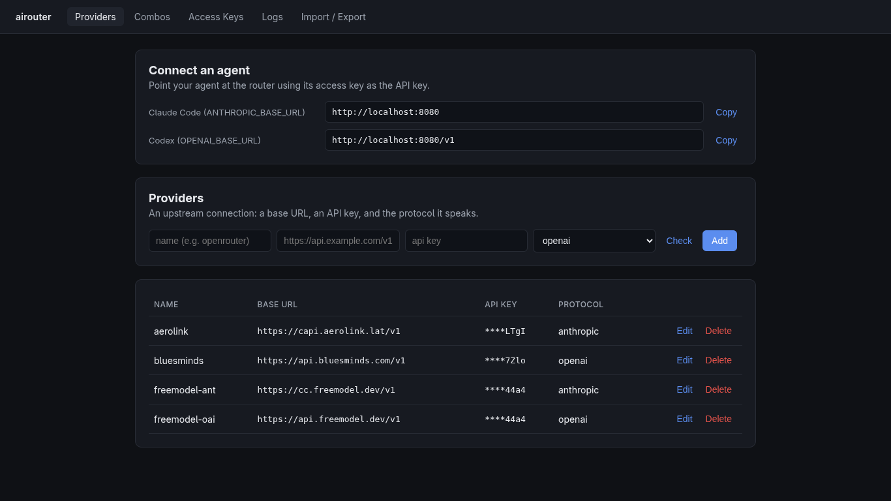

# airouter

A self-hosted, bidirectional AI inference router. Register OpenAI- or
Anthropic-compatible upstreams, expose them under custom model names, and call
them through whichever API format your client speaks. airouter translates
between the OpenAI and Anthropic wire formats on the fly, in both directions,
for unary and streaming requests.

A single Go binary serves both the proxy and a web dashboard. State lives in an
embedded SQLite database; there are no external service dependencies.

## How it works

Three concepts:

- **Provider** - an upstream connection: a base URL, an API key, the protocol
  it speaks (`openai` for Chat Completions, `anthropic` for Messages, or
  `openai-responses` for the OpenAI Responses API - for upstreams that only
  expose `/responses`), and an auth scheme - how the key is sent:
  `default` (sensible per protocol: `x-api-key` for Anthropic, `bearer` for the
  OpenAI formats), `bearer`, or `x-api-key`. The auth scheme is independent of the
  protocol, so an Anthropic-format upstream that authenticates with a bearer
  token (an `ANTHROPIC_AUTH_TOKEN`-style gateway) works by selecting protocol
  `anthropic` + auth `bearer`. The API key is encrypted at rest.
- **Combo** - a custom model name (e.g. `default`) backed by one or more
  targets, each a provider + real upstream model id (e.g. `gpt-4o`). Clients put
  the combo name in the request `model` field; airouter resolves it to a target
  and rewrites the model. With multiple targets, a strategy picks which to use:
  `failover` tries them in order, `round-robin` spreads load and still fails over
  past a dead target. The router advances to the next target on any upstream
  failure that happens before the response starts streaming; targets may mix
  protocols.
- **Access key** - a bearer token clients use to authenticate against the
  router. The full token is shown once at creation; only its hash is stored.

A request arrives on one of the ingress endpoints (the *ingress format*) and is
routed to a combo's provider (the *backend format*). When the two formats match,
the request passes through with only the model rewritten, preserving any
provider-specific fields. When they differ, the request and response are
translated through a canonical intermediate representation. Streaming responses
are translated event by event and flushed live.

This means an OpenAI SDK can call an Anthropic model, an Anthropic SDK can call
an OpenAI model, and the OpenAI Responses API can call either - all transparently.

## Endpoints

All proxy endpoints require an access key, sent as `Authorization: Bearer <key>`
or `x-api-key: <key>`.

| Endpoint | Ingress format | Notes |
|----------|----------------|-------|
| `POST /v1/chat/completions` | OpenAI Chat Completions | unary + streaming |
| `POST /v1/messages` | Anthropic Messages | unary + streaming |
| `POST /v1/responses` | OpenAI Responses | unary + streaming; always translates |
| `GET /v1/models` | - | lists configured combos |

Each endpoint is also served without the `/v1` prefix (e.g. `/messages`,
`/models`), so a provider base URL configured with or without `/v1` resolves
either way. This avoids a double prefix when a client hardcodes `/v1` onto the
base it is given.

Text, images, function/tool calling, and tool results are translated across all
formats. Streaming reassembles tool-call argument fragments correctly.

Browser clients on other origins are supported: the proxy answers the CORS
preflight and reflects the request origin, so a local web app can call airouter
directly.

The dashboard is served at `/dashboard`.



## Build and run

Requires Go 1.26+. The dashboard uses [templ](https://templ.guide); if you edit
any `.templ` file, regenerate the Go code first.

```sh
# install the templ CLI (only needed when editing .templ files)
go install github.com/a-h/templ/cmd/templ@latest

# regenerate templates (after editing .templ files)
templ generate

# build
go build -o airouter ./cmd/airouter

# run
AIROUTER_SECRET=$(openssl rand -hex 32) ./airouter
```

Then open http://localhost:8080/dashboard, add a provider, create a combo, and
generate an access key.

## Configuration

Each option is available as a flag or an environment variable. Flags take
precedence.

| Flag | Env | Default | Description |
|------|-----|---------|-------------|
| `-listen` | `AIROUTER_LISTEN` | `:8080` | HTTP listen address |
| `-db` | `AIROUTER_DB` | `airouter.db` | SQLite database path |
| `-secret` | `AIROUTER_SECRET` | (dev fallback) | Seeds the AES-256-GCM key encrypting provider API keys at rest |
| `-debug` | `AIROUTER_DEBUG` | `off` | Log verbosity. Bare `-debug` or `=1` logs request lines, client-facing failures, and upstream error exchanges. `=2` additionally traces full request and response bodies plus the resolved upstream URL for each proxied call (includes prompt content) |
| `-log-file` | `AIROUTER_LOG_FILE` | (stderr only) | Path to also append log output to, in addition to stderr. Captures everything `-debug` emits; at `=2` the file records full, untruncated request/response bodies while stderr stays truncated |

If `AIROUTER_SECRET` is unset, an insecure built-in key is used and a warning is
logged. Set a real secret in any deployment you care about; rotating it makes
existing encrypted provider keys unreadable.

## Usage example

After creating a combo named `default` and an access key:

```sh
# OpenAI-format client
curl http://localhost:8080/v1/chat/completions \
  -H "Authorization: Bearer sk-air-..." \
  -H "Content-Type: application/json" \
  -d '{"model":"default","messages":[{"role":"user","content":"hello"}]}'

# Anthropic-format client hitting the same combo
curl http://localhost:8080/v1/messages \
  -H "x-api-key: sk-air-..." \
  -H "Content-Type: application/json" \
  -d '{"model":"default","max_tokens":256,"messages":[{"role":"user","content":"hello"}]}'
```

The combo's provider protocol determines whether translation happens; the client
does not need to know or care which backend serves the request.

## Import / export

The dashboard's Import / Export page round-trips all providers (including their
auth scheme) and combos as JSON. Exports include provider API keys in plaintext
so config is portable across instances with different secrets - treat exported
files as secrets.
Import upserts by name and never deletes. Access keys are not exported (only
their hashes exist).

## Storage

A single SQLite file (WAL mode, pure-Go driver, no CGO). Schema is created and
migrated automatically on startup.
