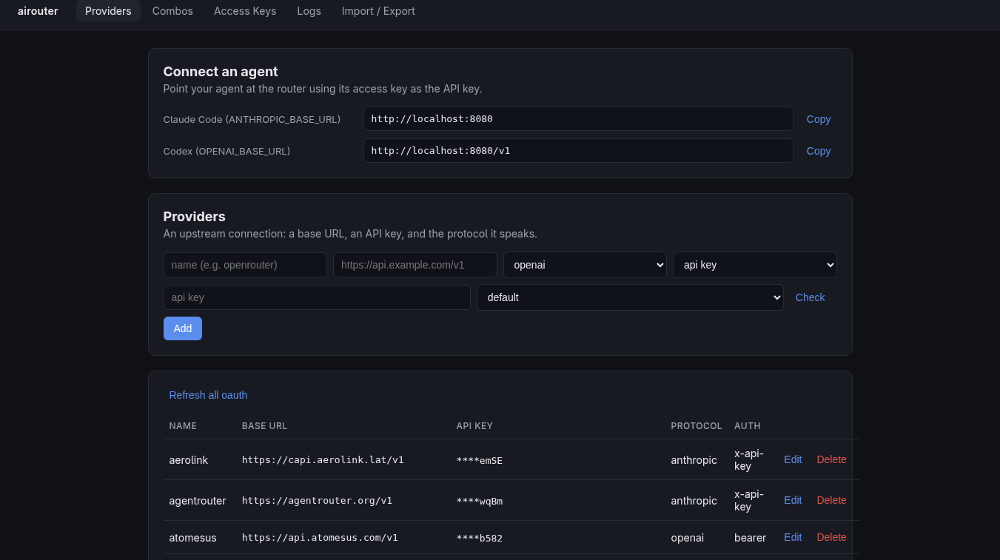

# airouter

A self-hosted AI inference router with an embedded web dashboard. Point OpenAI,
Anthropic, or compatible clients at one endpoint and route them to different
providers under your own model names.

- OpenAI Chat Completions, OpenAI Responses, and Anthropic Messages APIs
- Bidirectional format translation for unary and streaming requests
- Text, images, PDFs, reasoning, tool calls, and tool results
- Ordered failover or round-robin routing across providers
- API key and OAuth provider connections
- Single Go binary with embedded SQLite; no external services

## Quick start

Download a binary from [Releases](https://github.com/sabitm/airouter/releases), or
build from source with Go 1.26.1+:

```sh
go build -o airouter ./cmd/airouter
```

Generate a secret, keep it stable across restarts, and run:

```sh
export AIROUTER_SECRET="$(openssl rand -hex 32)"
./airouter
```

Open [http://localhost:31415/dashboard](http://localhost:31415/dashboard), then:

1. Add and check a provider.
2. Create a combo that maps a public model name to one or more provider models.
3. Generate an access key.
4. Use the airouter URL, access key, and combo name in your client.

The dashboard also shows ready-to-copy base URLs for Claude Code and Codex.



## Supported providers

Generic connections support OpenAI Chat Completions, OpenAI Responses, and
Anthropic-compatible APIs. The dashboard also includes guided connections for:

| Connection | Authentication |
|---|---|
| Grok (xAI) | OAuth |
| OpenAI Codex (ChatGPT) | OAuth |
| Cline / ClinePass | OAuth |
| Kiro (AWS CodeWhisperer) | API key or OAuth |
| Qoder | OAuth device flow |
| Antigravity (Google Cloud Code) | OAuth; unofficial |
| Cursor IDE | Imported IDE token; unofficial |
| Claude Code | OAuth; unofficial |

Provider credentials and OAuth tokens are encrypted in SQLite using
`AIROUTER_SECRET`. OAuth tokens are refreshed automatically when supported.

## Client API

| Endpoint | Format |
|---|---|
| `POST /v1/chat/completions` | OpenAI Chat Completions |
| `POST /v1/responses` | OpenAI Responses |
| `POST /v1/messages` | Anthropic Messages |
| `GET /v1/models` | Configured combos |

The same routes are available without `/v1`. Use a combo name as the request's
`model`. When at least one access key exists, authenticate with either:

```text
Authorization: Bearer sk-air-...
x-api-key: sk-air-...
```

Example:

```sh
curl http://localhost:31415/v1/chat/completions \
  -H "Authorization: Bearer sk-air-..." \
  -H "Content-Type: application/json" \
  -d '{"model":"default","messages":[{"role":"user","content":"hello"}]}'
```

When no access keys exist, proxy endpoints run in open mode.

## Routing

- A **provider** is an upstream URL, protocol, and credential.
- A **combo** is the model name clients use. Each target maps a provider to its
  real upstream model ID.
- An **access key** authenticates clients to airouter. Its full value is shown
  once; only its hash is stored.

`failover` tries targets in order. `roundrobin` rotates the first target and still
fails over if it cannot start a response. Repeatedly failing providers are
temporarily deprioritized.

Matching API formats pass through with only the model rewritten, preserving
provider-specific fields. Different formats are translated automatically,
including live streams.

## Configuration

Flags override environment variables.

| Flag | Environment | Default | Purpose |
|---|---|---|---|
| `-listen` | `AIROUTER_LISTEN` | `:31415` | HTTP listen address |
| `-db` | `AIROUTER_DB` | `airouter.db` | SQLite database path |
| `-secret` | `AIROUTER_SECRET` | insecure development key | Credential encryption secret |
| `-debug` | `AIROUTER_DEBUG` | `0` | `1` for request diagnostics; `2` for metadata traces |
| `-har-file` | `AIROUTER_HAR_FILE` | unset | Always-on HAR capture and shutdown output path |
| `-disable-dashboard` | `AIROUTER_DISABLE_DASHBOARD` | `false` | Do not mount the web dashboard or `/static` assets |
| `-version` | — | `false` | Print the version and exit |

Debug logs never include request or response bodies. Capture full exchanges from
**Dashboard > Settings**, or use `-har-file`. HAR files include prompts,
responses, authorization headers, and provider credentials.

## Security and data

- Always set and retain a strong `AIROUTER_SECRET`. Changing it makes existing
  encrypted credentials unreadable.
- The dashboard controls providers and exposes plaintext config exports. It has
  no built-in login; keep it on a trusted network or protect it with an
  authenticated reverse proxy. In production, prefer `-disable-dashboard` so
  the UI, `/static` assets, config import/export, and OAuth connect flows are
  not mounted.
- Config exports include provider API keys and OAuth tokens in plaintext. Access
  keys and request logs are not exported.
- HAR captures contain sensitive headers and bodies. Store and share them as
  secrets. `-disable-dashboard` does not disable `GET /debug/har`; that
  endpoint remains mounted and may serve captured prompts and credentials.

State is stored in one automatically migrated SQLite database using WAL mode.
Provider credentials are encrypted at rest; access keys are hashed.

## Development

```sh
templ generate   # after editing internal/web/*.templ
go test ./...
go vet ./...
```

[MIT License](LICENSE)
